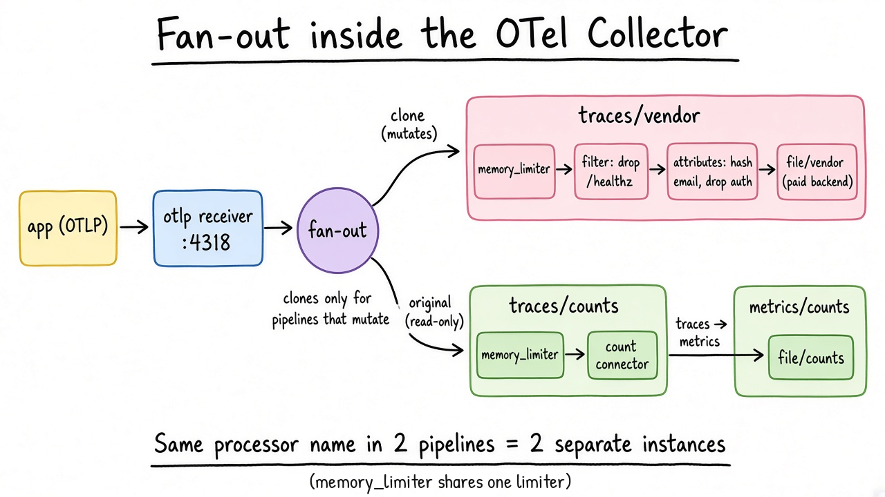
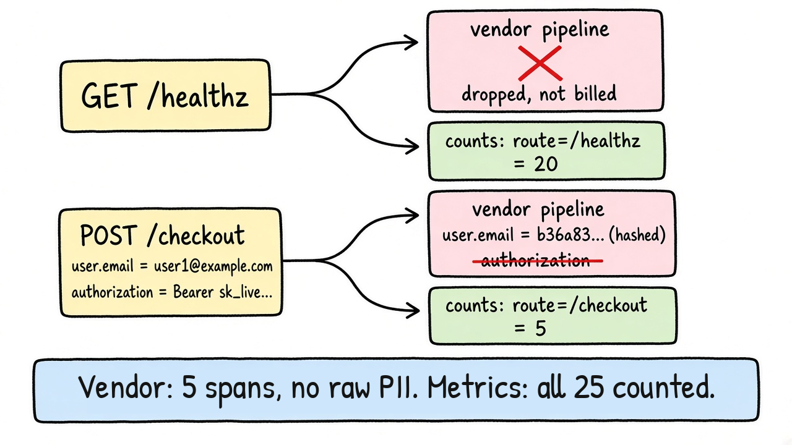

# One span in, two truths out: the fan-out inside the OpenTelemetry Collector

Your load balancer hits `/healthz` every few seconds. Every hit becomes a span, every span gets shipped to your tracing vendor, and every span gets billed. Meanwhile someone added `user.email` to the checkout span last sprint, so customer emails now live in a third party's database.

You want three things at once: stop paying for health checks, keep knowing how many there were, and scrub PII before anything leaves your network. Without touching application code.

That is a job for the OpenTelemetry Collector. The reason it can do all three is a small piece of code most people never read: the fan-out.

## What it is

OpenTelemetry is the vendor-neutral standard for traces, metrics, and logs. It moved to CNCF Graduated on May 11, 2026. The Collector is its standalone agent and gateway: a Go binary that receives telemetry, processes it, and exports it anywhere.

## The mechanism: a graph, not a pipe

A Collector config has four kinds of components: receivers (data in), processors (modify or drop), exporters (data out), and connectors (the exporter of one pipeline and the receiver of another). Defining a component does nothing. Only `service.pipelines` wires them into a graph.

The interesting part is what happens when one receiver feeds two pipelines.

The Collector puts a fan-out consumer between the receiver and its pipelines. At startup, every processor declares whether it mutates data (`MutatesData`), and one mutating processor makes its whole pipeline a mutator. The fan-out uses that to decide who gets a copy:

- Pipelines that only read share the original, marked read-only if there are several.
- Pipelines that mutate get their own clone.
- If every downstream pipeline mutates, the last one gets the original, saving one clone.

The source comment in `internal/fanoutconsumer` says it plainly: "Clones only to the consumer that needs to mutate the data." A processor listed in two pipelines also becomes two separate instances. Exception: `memory_limiter` shares one limiter across pipelines, since it guards the whole process.

In our scenario, pipeline A drops `/healthz` and hashes the email, so it mutates. Pipeline B only counts spans by route, so it reads. A gets a clone, B gets the original, so A's edits never reach B.



## Hands-on: 25 spans, two pipelines

The companion example runs a tiny Go "checkout-api" that emits 20 `/healthz` spans and 5 `/checkout` spans carrying `user.email` and an `Authorization` header. The app knows nothing about filtering; the config does the work:

```yaml
service:
  pipelines:
    traces/vendor:
      receivers: [otlp]
      processors:
        [memory_limiter, filter/drop_healthz, attributes/scrub]
      exporters: [file/vendor]   # stand-in for your paid backend
    traces/counts:
      receivers: [otlp]
      processors: [memory_limiter]
      exporters: [count]         # connector: traces -> metrics
    metrics/counts:
      receivers: [count]
      exporters: [file/counts]
```

The filter is one OTTL condition; matching spans are dropped: `span.attributes["http.route"] == "/healthz"`. The scrub hashes `user.email` and deletes the auth header.

Run `./run.sh`. Real output from Collector v0.162.0, trimmed:

```
== traces/vendor (what your paid backend receives) ==
spans by route: {'/checkout': 5}
  user.email = b36a83701f1c3191...ebf33313e440fe4b0fe210

== metrics/counts (fed by the count connector, before filtering) ==
app.span.count{http.route="/checkout"} = 5
app.span.count{http.route="/healthz"} = 20
```

The vendor got 5 spans instead of 25, with no raw email and no token. You still know there were 20 health checks, as one metric series instead of 20 spans.



## Gotchas

**Configured is not enabled.** Delete `attributes/scrub` from the pipeline list but keep its definition. `otelcol validate` passes, the Collector starts without a warning, and the raw email and `Bearer` token go straight to the vendor. The repo ships it as `gotcha-unwired.yaml`. Review the `pipelines` block, not the processor block.

**Order is the program.** Processors run in the order listed. The docs recommend `memory_limiter` first, then anything that drops data, then transforms, then batching (ideally the exporter's own). Hash an attribute before a filter that matches on its raw value, and the filter quietly matches nothing.

**Hashing is not anonymizing.** In v0.162.0 the `hash` action is unsalted SHA-256. The processor's README still says SHA-1; the code and our output say SHA-256. Anyone holding your user list can hash it and join. Use `delete` when you do not need to group by user.

**Every mutating pipeline costs a clone.** Five mutating pipelines on one receiver cost at least four full copies of every batch. Free at demo scale, worth measuring at high volume.

**Fan-out is synchronous.** It calls each pipeline in turn and returns the combined error to the receiver. If one pipeline refuses data, say `memory_limiter` shedding load, the client sees a failure and may retry. That retry can duplicate data in the pipeline that already accepted it.

## When to use it, when to skip it

Use it when you have more than one backend (or might switch), need to strip PII or noise centrally, or want to change telemetry without redeploying services. For a -1 -> 0 team it is the cheapest vendor exit you can buy: the app speaks OTLP, the Collector owns the routing.

Skip it if you run one service, one backend, and low volume. The SDK can export straight to the backend, and a Collector is one more process to run and size. If you adopt it, note the contrib binary is about 400 MB unpacked on linux/amd64 (a 112 MB download) because it bundles every component. For production, the OpenTelemetry Collector Builder (`ocb`) builds a distribution with only the components you use.

## Try it

The Go app, both configs, and a one-command runner (no Docker needed):

https://github.com/Apoorvgarg-creator/articles-linkedin/tree/main/otel-collector-art

Run `./run.sh`, then `./run.sh gotcha-unwired.yaml`, and watch the token leak. After the one-time download, a run takes seconds. It will change how you review the next Collector config in a PR.

Which CNCF project should I open up next Wednesday? Reply and tell me.
