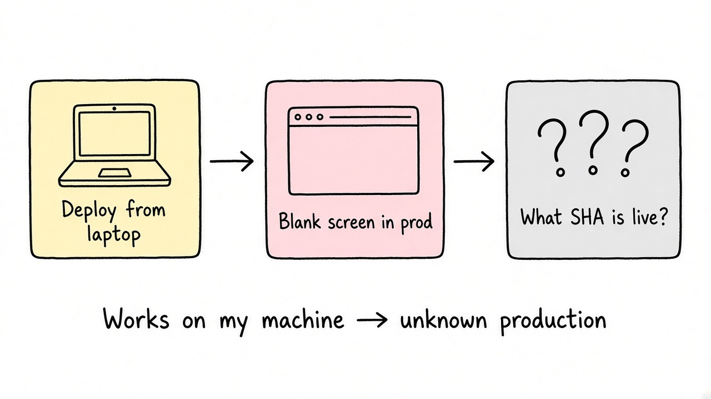
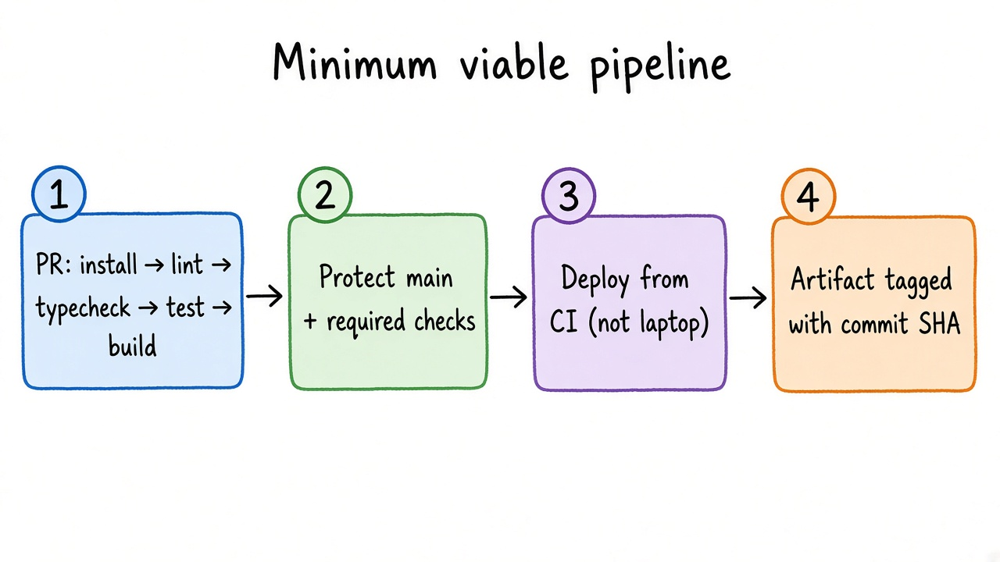

# The Pipeline You Need Before You Have a Team

*Production Stories 101, Issue #1*
*Cover: Weekly commits*

It was a Friday evening. Two of us, one product, a demo with a design partner on Monday morning.

I merged a "tiny" fix, ran the deploy script from my laptop, and went to get dinner. Twenty minutes later the app was serving a blank screen. The fix was fine. My laptop had a newer build dependency than anything we'd pinned, and the bundle only worked on my machine. Nobody else could reproduce it. Rolling back meant figuring out which commit was actually live, and we didn't know, because "live" was whatever I had last built locally.

That weekend I didn't write a single feature. I wrote our first pipeline.

That's the first lesson of going from -1 to 0. CI/CD at this stage isn't about DevOps maturity. It's about one boring, repeatable answer to two questions: **"Does this build?"** and **"What is running in production right now?"**

## Should you even bother this early?

Fair question. Pre-product, every hour on infrastructure is an hour not spent finding out if anyone wants the thing.

My rule: the moment a second person can push code, or a real user depends on uptime, you need a pipeline. Before that, a script is enough.

Small teams have no slack. When one of two engineers loses a day to "works on my machine," you've lost half your capacity. A pipeline is cheap insurance, not a project. If setup takes more than an afternoon, you're building for a company you don't have yet.

## The minimum viable pipeline

Here's what I set up first, and what I left out.

**1. One workflow on every pull request: install, lint, typecheck, test, build.**
Same commands you run locally. Use a lockfile (`npm ci`, not `npm install`). Pin the runtime in the repo so laptops and CI share one source. This alone would have prevented my Friday.

**2. Make `main` protected and make the check required.**
A green check nobody waits for is decoration. Require CI to pass before merge. Gotcha: keep required job names unique across workflows, or you'll get blocked PRs. On GitHub Free, several protection features (environment rules, environment secrets) are public-repo only. Find that out before you design around them.

**3. Deploy from CI, never from a laptop.**
Merge to `main` triggers a deploy. Tag the artifact with the commit SHA. Now "what's in production" has an answer you can look up. Rollback becomes "redeploy the previous SHA," a boring button instead of archaeology.

**4. Cancel stale runs and cap job time.**
Add a `concurrency` group with `cancel-in-progress: true` so three quick pushes don't run three full pipelines. Set an explicit `timeout-minutes`. GitHub's default is 360 minutes; a hung test can quietly eat your free allowance.

That's it. No matrix builds, no preview environments, no Kubernetes, no custom runners.

## Money and time

GitHub Free includes 2,000 Actions minutes per month for private repos on standard hosted runners (public repos don't consume them). Linux is cheapest; macOS costs roughly ten times as much. If you're building mobile, that multiplier is your real budget line.

Things that burn minutes for no value:

- Full suite on every branch push *and* again on the PR
- No dependency caching, so every run reinstalls the world
- Retrying flaky tests instead of fixing them (you pay for both runs)

Self-hosting looks free until you count the machine, the secrets, and your time at 2 a.m. At -1 to 0, use hosted runners until the bill hurts. Keep the PR pipeline fast enough that nobody context-switches while waiting.

## Add things only when pain shows up

Every item below is good. None belong in week one. Add each when you feel the pain it solves.

- **Staging** → when something passed tests but broke against real config or data shapes
- **Migration checks in CI** → the first time a migration locks a table or fails halfway in prod
- **Preview deploys per PR** → when non-engineers need to see changes before merge
- **Manual approval before prod** → when deploys carry real risk (`workflow_dispatch` plus discipline works as an interim)
- **Short-lived cloud credentials via OIDC** → as soon as you deploy to a cloud provider
- **Test sharding or parallel jobs** → when the suite is slow enough that people stop waiting

## The traps I see repeatedly

**The pipeline that only the founder understands.** A 600-line YAML with clever conditionals is a single point of failure that also blocks every merge. Keep it readable. Put real logic in repo scripts (`scripts/ci.sh`, `make test`) so CI and laptops run the same thing.

**Green CI, broken prod.** Tests passed, but prod has different env vars, a different database version, or a flag nobody set. Add a post-deploy smoke check that hits one real endpoint and fails loudly. Ten lines, catches a surprising class of bugs.

**Flaky tests nobody owns.** The first flaky test is a warning. The fifth trains everyone to hit "re-run" without reading. Quarantine or fix immediately. Flakiness compounds.

## The lesson for -1 to 0 builders

The goal of your first pipeline isn't to be impressive. It's to make the right thing the easy thing: every change builds the same way, every deploy is traceable to a commit, and rollback is boring.

Start with one workflow. Protect `main`. Deploy from CI. Cap your timeouts. Then let real pain, not blog posts, tell you what to add next.

That Friday cost us a weekend. The pipeline I wrote that weekend was a few dozen lines of YAML. Still some of the highest-leverage lines I have ever written.

The companion for this issue lives in [`production-stories-101-cicd`](https://github.com/Apoorvgarg-creator/articles-linkedin/tree/main/production-stories-101-cicd) on GitHub: article, diagrams, and a starter pipeline you can fork. Break it, and tell me what your first production failure taught you. Best story gets featured in a future issue of Production Stories 101.
