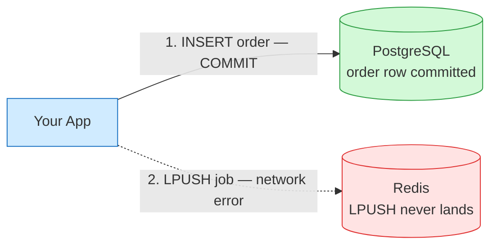
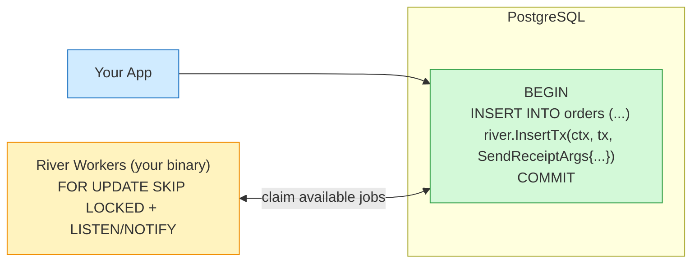
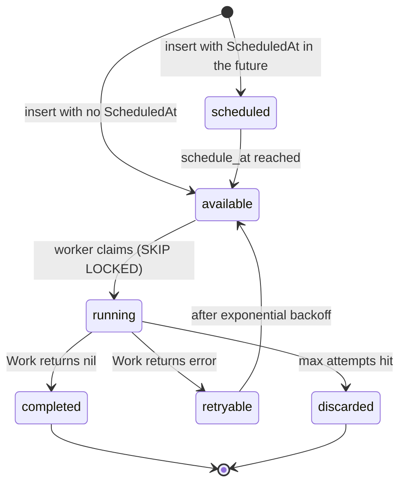

# River — Fast and reliable background jobs in Go, backed by Postgres

> Atomic, transaction-safe job queueing for Go applications. Backed by PostgreSQL and built to scale.

If you have ever written code that looks like this:

```go
db.Save(&order)
redis.LPush("send_receipt", order.ID)
```

…you have built a small distributed system that can lie to your users. This article is about why, and about a Go library called **River** that makes that whole class of bug go away.

It is written for engineers who already know what a queue is and are deciding whether to use one — not a Sidekiq tour. By the end you will know what River actually buys you, the trade-offs against Redis-based queues, the lifecycle of a job inside it, and the smallest possible end-to-end example.

---

## TL;DR

- **River is a background job queue for Go that stores jobs in PostgreSQL.** No Redis, no Kafka, no extra infra.
- **Enqueue and your business write happen in the same transaction.** If the DB rolls back, the job vanishes with it. If the DB commits, the job is guaranteed to be there.
- **Workers are part of your Go binary.** Same compiler, same types, same deploys. Job args are typed Go structs, not stringly-typed JSON blobs.
- **It uses `FOR UPDATE SKIP LOCKED` + `LISTEN/NOTIFY`** to fan out work to many workers without contention and with low latency.
- **You get retries, scheduled jobs, periodic (cron) jobs, unique jobs, priorities, queues, a web UI, and Prometheus metrics** out of the box.

If your app already talks to Postgres, River is the smallest possible step from "I need background work" to "I have a queue."

---

## What is a background job queue, in one paragraph

A request hits your server. Some of the work it needs to do — send an email, charge a card, transcode a video, sync a third-party — is too slow, too flaky, or too expensive to do inline. So you write a row that says *"please do this later"*, return `200 OK`, and a separate process picks that row up and does the work. That row is a **job**. The thing it sits in is a **queue**. The process that drains it is a **worker**.

Queues are easy to draw and surprisingly hard to get right. The hard part is almost never the worker. The hard part is the moment of enqueue.

---

## The dual-write problem

Most production Go services I have seen reach for Redis-backed queues — Asynq, Machinery, BullMQ on the Node side, Sidekiq on the Ruby side. They are fast, they have great dashboards, and they have one structural problem: **enqueueing a job is a write to a different system than your business write.**

That means every enqueue site is implicitly a two-phase commit you didn't ask for.

> ▶ View the source diagram in Excalidraw:
> https://app.excalidraw.com/s/1PTaIRZVycu/xfDI8e9M8h



Pick any failure mode you like:

- The DB commit succeeds, the Redis `LPUSH` times out. **Order saved. Receipt email never goes out.**
- The Redis `LPUSH` succeeds, the DB commit gets rolled back (validation error, deadlock retry, anything). **Email sent for an order that doesn't exist.**
- Both succeed, but the worker reads the job before the DB transaction is visible to the replica it queries. **Worker can't find the row it's supposed to act on, retries forever.**

You can paper over each of these with the outbox pattern, transactional outboxes, idempotency keys, change-data-capture, etc. They all work. They are all extra infrastructure to maintain a property that, it turns out, your database already has.

---

## How River fixes it: one transaction

River's central trick is dead simple. The job row lives in the same Postgres database as your application data, in a table called `river_job`. So when you enqueue, you don't make a second network call — you make a second `INSERT` inside the transaction you were already going to commit.

> ▶ View the source diagram in Excalidraw:
> https://app.excalidraw.com/s/1PTaIRZVycu/1zYZ2hffUxi



The consequences are nice:

- If the business `INSERT` rolls back, the job row rolls back with it. **No ghost jobs.**
- If the COMMIT succeeds, the job is in the queue, durably, before the HTTP response leaves your server. **No lost jobs.**
- Workers see the job exactly when, and only when, the transaction is visible to readers. **No "row not found" retry storms.**
- Your DR plan is "back up Postgres." You already do that.

On the dequeue side, River uses `SELECT ... FOR UPDATE SKIP LOCKED` so workers don't fight each other for the same row, and `LISTEN/NOTIFY` so they don't have to poll aggressively to find new work. It scales further than people give Postgres credit for — easily into the thousands of jobs per second on a normal box, which is past where most apps need a queue at all.

### River vs Redis-based queues, at a glance

| | Redis-backed (Sidekiq, Asynq, BullMQ) | River (Postgres) |
|---|---|---|
| Extra infra | Redis cluster | None (uses your existing DB) |
| Enqueue safety | Two-phase across systems | Single DB transaction |
| Outbox pattern | Usually needed | Not needed |
| Job arg type safety | JSON blobs | Typed Go structs |
| Backups | Separate (Redis RDB/AOF) | Same as your DB |
| Throughput ceiling | Very high (Redis is fast) | High enough for ~all apps |
| Best at | Throughput-dominated workloads | Correctness-dominated workloads |

River is not trying to beat Redis on raw throughput. It is trying to beat *"we shipped a receipt-email outage because Redis hiccuped at 3am."*

---

## The lifecycle of a job

Once a job is in Postgres, it walks through a small state machine. River persists every transition, so you can always answer *"what is this job doing right now?"* with one SQL query — or one click in the web UI.

> ▶ View the source diagram in Excalidraw:
> https://app.excalidraw.com/s/1PTaIRZVycu/5Azt8UjDldo



Two things worth knowing:

- **Backoff is exponential by default**, configurable per worker (`Timeout`, `MaxAttempts`, `NextRetry`). You override `NextRetry` to do custom schedules.
- **`completed` rows stick around** so you can inspect them, but River ships a `JobCleaner` background service that prunes them on a schedule you control. You don't end up with a table that grows forever.

There are a couple more states (`cancelled`, `pending`) for edge cases, but those four — *available, running, retryable, discarded* — are the daily-driving ones.

---

## The smallest possible River, end to end

Here is the entire surface area: define a typed args struct, define a worker, register it, start the client, and enqueue inside a transaction.

```go
package main

import (
	"context"
	"log/slog"
	"os"
	"time"

	"github.com/jackc/pgx/v5/pgxpool"
	"github.com/riverqueue/river"
	"github.com/riverqueue/river/riverdriver/riverpgxv5"
)

type SendReceiptArgs struct {
	OrderID string `json:"order_id"`
	Email   string `json:"email"`
}

func (SendReceiptArgs) Kind() string { return "send_receipt" }

type SendReceiptWorker struct {
	river.WorkerDefaults[SendReceiptArgs]
}

func (w *SendReceiptWorker) Work(ctx context.Context, job *river.Job[SendReceiptArgs]) error {
	slog.Info("sending receipt", "order", job.Args.OrderID, "attempt", job.Attempt)
	return nil // returning a non-nil error here triggers River's retry/backoff
}

func main() {
	ctx := context.Background()

	pool, err := pgxpool.New(ctx, os.Getenv("DATABASE_URL"))
	must(err)
	defer pool.Close()

	workers := river.NewWorkers()
	river.AddWorker(workers, &SendReceiptWorker{})

	client, err := river.NewClient(riverpgxv5.New(pool), &river.Config{
		Queues:  map[string]river.QueueConfig{river.QueueDefault: {MaxWorkers: 10}},
		Workers: workers,
	})
	must(err)

	must(client.Start(ctx))
	defer client.Stop(ctx)

	tx, err := pool.Begin(ctx)
	must(err)
	defer tx.Rollback(ctx)

	_, err = tx.Exec(ctx, `INSERT INTO orders (id, total_cents) VALUES ($1, $2)`, "ord_42", 4999)
	must(err)

	// the enqueue is just another INSERT in the same transaction
	_, err = client.InsertTx(ctx, tx, SendReceiptArgs{OrderID: "ord_42", Email: "a@b.com"}, nil)
	must(err)

	must(tx.Commit(ctx))

	time.Sleep(2 * time.Second) // let the in-process worker drain before we exit
}

func must(err error) {
	if err != nil {
		panic(err)
	}
}
```

What this 50-line program demonstrates:

1. **`SendReceiptArgs` is a real Go struct.** No `map[string]any`. The worker signature is `*river.Job[SendReceiptArgs]`, so the compiler enforces the contract end-to-end.
2. **`client.InsertTx` is the headline feature.** The enqueue is one of the SQL statements inside `tx`. The order INSERT and the job INSERT are visible together or not at all.
3. **The worker runs inside the same binary as the enqueuer in this demo.** In production you'd usually split that — but you don't have to, and you can ship a single binary in tiny services.
4. **No Redis. No outbox. No idempotency key. No retry loop you wrote yourself.**

To run it you need the River schema in the same database — one `river migrate up` call, or a single Go function in tests. That is the entire integration story.

A runnable version of the example, including the Postgres `docker-compose.yml` and the migration step, lives here:

➡ **Example repo:** `https://github.com/<your-handle>/riverqueue-art-example` *(swap in your fork — the code under `example/` in this repo is the same program plus a one-command bootstrap.)*

---

## What you actually get out of the box

Things you'd otherwise build, debug, and own:

- **Retries with exponential backoff**, plus `Timeout`, `MaxAttempts`, and `NextRetry` per worker.
- **Scheduled jobs** (`ScheduledAt`) — "run this in two hours."
- **Periodic jobs** (cron) — "every 5 minutes, sweep stale carts."
- **Unique jobs** — "no more than one `sync_user_42` running or queued at a time."
- **Priorities and named queues** — separate `default`, `email`, `transcoding` queues with their own worker counts.
- **Snooze and cancel from inside `Work`** — return `river.JobSnooze(...)` or `river.JobCancel(...)`.
- **A web UI (River UI)** that shows running, retrying, and failed jobs with full args and stack traces.
- **Prometheus metrics** for queue depth, attempts, latencies.
- **Hooks and middleware** for tracing, logging, auth context propagation.

The mental model is consistent across all of these: every feature is "a column or a row in `river_job`." That's the whole reason it's small enough to feel boring in the best way.

---

## When River is not the right tool

Be honest about the trade-offs. Reach for something else if:

- **You don't have Postgres.** River is Postgres-only. If your stack is MySQL or MongoDB, this is not your library.
- **You need millions of jobs per second on one queue.** Redis Streams or Kafka will hold up further. River is comfortable into the low thousands per second per Postgres instance, which is past the needs of almost every product I have seen, but not infinite.
- **Your "jobs" are really a streaming pipeline** (CDC fan-out, event sourcing, log replay). Use Kafka/Pulsar/NATS. A job queue is the wrong abstraction.
- **Your workers aren't written in Go.** River is a Go library. There are Postgres-backed queues for other languages, but it's not one of them.

For everything in between — the "we need to send emails, charge cards, sync webhooks, and run a few cron jobs" shape that most backends have — River is the lightest setup that still gets correctness right.

---

## Try it

1. Clone the example repo (link above) or copy the `example/` folder.
2. `docker compose up -d` to start Postgres.
3. `go run ./cmd/migrate` to apply the River schema.
4. `go run .` to enqueue an order + job in one transaction and watch the worker drain it.

The whole loop is under a minute on a cold machine. If you have a service that currently does `db.Save` followed by `redis.LPush`, that minute is well spent.

---

*Article diagrams are editable Excalidraw scenes — open the links above to remix them for your own writeups.*
